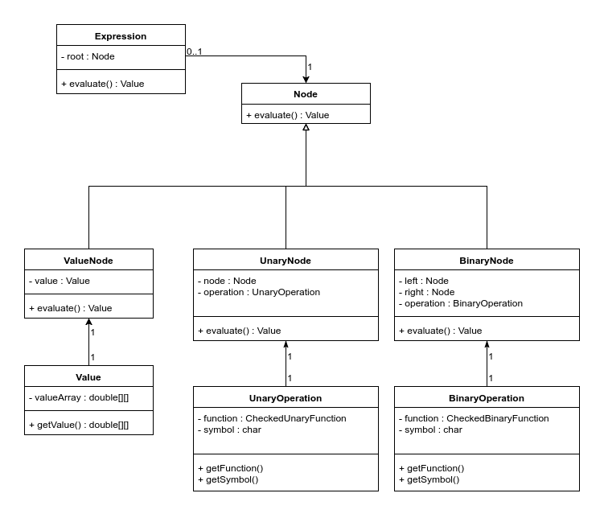

## Topic Description

**Topic:**
A visualizer of arithmetic expressions. Expressions consist of two arrays which can be scalars, vectors or matrices. They can be added, subtracted or multiplied. Expressions are evaluated step by step with intermediate results displayed. In particular, matrix-matrix multiplication and matrix-vector multiplication are visually presented as a sequence of dot products.

**Actors:**
A single user.

**Functionality:**
* Creating arithmetic expressions via a graphical interface.
* Once an expression has been graphically evaluated, the user may choose to use the resulting array as an operand (or as both operands) in the next expression.

**Class Diagram:**
* A class diagram is provided below.
* JavaFX Scene Controllers are omitted for clarity.

**Sequence Diagrams:**
* This sequence diagram illustrates entering an operand in the entry scene.

* This sequence diagram illustrates the creation of a node in the entry scene.

