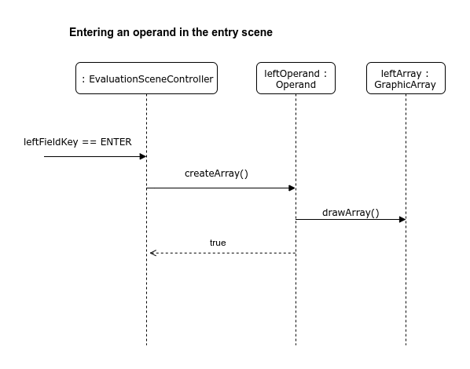
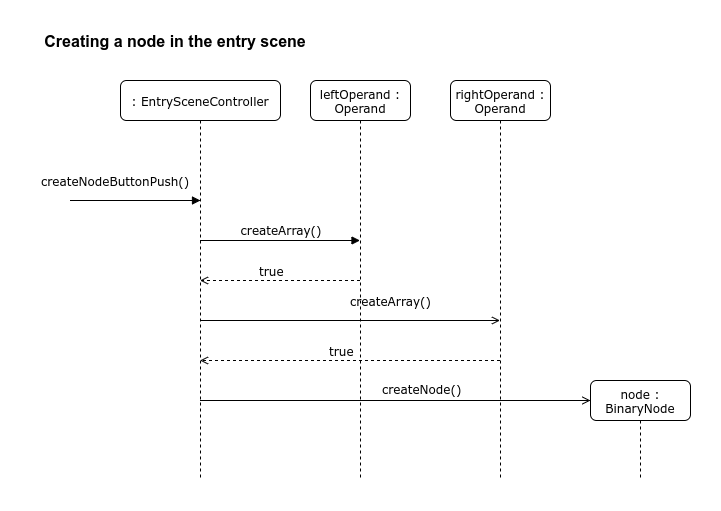

## Topic Description

**Topic:**

A visualizer of arithmetic expressions. Expressions consist of two arrays which can be scalars, vectors or matrices. They can be added, subtracted or multiplied. Expressions are evaluated step by step with intermediate results displayed. In particular, matrix-matrix multiplication and matrix-vector multiplication are visually presented as a sequence of dot products.

**Actors:**

A single user.

**Functionality:**
* Creating arithmetic expressions via a graphical interface.
* Once an expression has been graphically evaluated, the user may choose to use the resulting array as an operand (or as both operands) in the next expression.

**Program Structure:**

The application opens in the entry scene where the user is prompted to enter two arrays and choose an operation to apply to them. The entry scene is controlled by an instance of the class EntrySceneController, and each operand is managed by an Operand instance. The operands are drawn on the screen by instances of the class GraphicArray.

After entering the operands and choosing the operation, the user may click the Evaluate button to move to the evaluation scene of the application. A BinaryNode object containing two ValueNodes (each corresponding to an Operand) as children is handed to an EvaluationSceneController object. A Visualizer object, responsible for animating the evaluation of the operation, is created.

The user is presented with a play/pause button; once the button is pressed, the Visualizer object queries the BinaryNode for a FrameSequence object and plays an animation of the operation specified in entry scene based on the Frame objects contained in the FrameSequence. Each Frame tells the Visualizer which array elements should be active (i.e. highlighted) in the operand and result arrays and which elements of the result array are to be displayed. In addition, each Frame contains a String representation (e.g. "2.0 + 3.0 = 5.0") of the operation taking place in that Frame; this too is displayed by the Visualizer. After the animation has been displayed, the user may choose to use the result as one or both operands (or neither) and return to the entry scene to enter a new operation.

**Class Diagram:**
* A class diagram is provided below.

**Sequence Diagrams:**
* This sequence diagram illustrates entering an operand in the entry scene.

* This sequence diagram illustrates the creation of a node in the entry scene.

