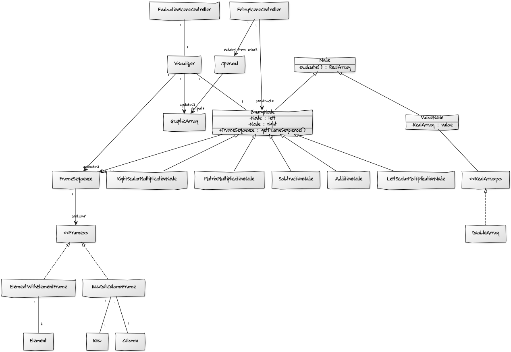

## Topic Description

**Topic:**
A visualizer of arithmetic expressions. At this point, expressions consist of two arrays which can be scalars, vectors or matrices. They can be added, subtracted or multiplied. Expressions will be evaluated step by step with intermediate results displayed. In particular, matrix-matrix multiplication and matrix-vector multiplication are visually presented as a sequence of dot products.

**Actors:**
A single user.

**Functionality:**
* Creating arithmetic expressions via a graphical interface.
* Expressions may also be entered as strings. (This will only be implemented if time permits.)

**Class Diagram:**
* A class diagram is provided below.
* A few things to consider about the diagram:'
  * The class diagram is undergoing major changes at the moment.
  * Expression objects are not very useful at this time. They will come in handy if inputting expressions as strings is implemented at some point.

